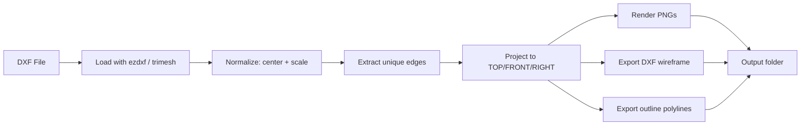

# DXF Agent Workbench – Orthographic Renderer

[](https://www.python.org/downloads/)
[](https://opensource.org/licenses/MIT)
[](https://github.com/ruledicaprio/dxf-agent-workbench/releases)

## 🤖 For AI Agents

This repository is **agent‑friendly**. See:
- [AGENTS.md](AGENTS.md) for operational rules.
- [CLAUDE.md](CLAUDE.md) for architectural decisions.
- [llms.txt](llms.txt) for a concise index.
- [llms-full.txt](llms-full.txt) for a comprehensive context dump.

**Fast, robust orthographic rendering of large 3D DXF meshes** – built for engineering drawings, and high‑poly CAD models.

- ✅ Handles **millions of faces** (tested with 2M+)
- ✅ Automatic centering & scaling
- ✅ Clean TOP / FRONT / RIGHT views (plus isometric optional)
- ✅ PNG output at any resolution (default 3200 px)
- ✅ Optional DXF wireframe and outline exports

---

## Quickstart

```bash
# Install from GitHub
pip install git+https://github.com/ruledicaprio/dxf-agent-workbench.git

# Render all three views (PNG only)
dxf-ortho model.dxf --size 3200 --out ./preview

# Also export a DXF wireframe layout
dxf-ortho model.dxf --dxf-out layout.dxf

# Export simplified outlines (closed polylines)
dxf-ortho model.dxf --dxf-outline outlines.dxf
```
---

## Pipeline



---

## Options

| Argument | Description |
|----------|-------------|
| input | Path to the DXF file |
| --out | Output folder (default: <input>_ORTHO) |
| --size | Image size in pixels (default: 3200) |
| --views | Comma‑separated list: top,front,right,iso (default: all except iso) |
| --max-edges | Cap the number of rendered edges (default: 8,000,000) |
| --max-faces | Limit loaded faces for memory (e.g., --max-faces 1000000) |
| --dxf-out | Save a DXF with all projected views side‑by‑side |
| --dxf-outline | Save a DXF with simplified outer contours (closed polylines) |
| --dxf-max-mb | Target DXF file size (overrides edge count) |

---

## Project Structure

```
dxf-agent-workbench/
├── src/dxf_agent/export/
│   ├── orthographic.py   # main CLI
│   └── ortho_dxf.py      # DXF export helpers
├── corpus/               # example DXF files
├── docs/                 # architecture & research
└── tests/                # unit / integration tests
```

---

## Contributing

Please read AGENTS.md and CLAUDE.md for operational rules.

Keep commits small and conventional (feat:, fix:, docs:).

Run pytest before committing.

Never commit large binaries – use .data/ or .gitignore.

---

##  License

MIT © 2026 Rusmir Skopljak
